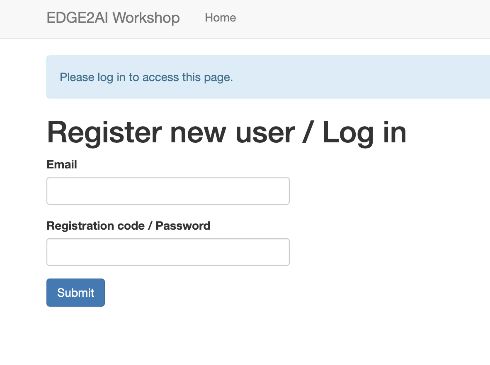

# CSO - Hands-on Lab

The primary goal of this repo is to cover the following-->

**1.** Using Nifi as a ingestion and transformation tool to:
    - Ingest data from a local repository into HDFS
    - Pre-process the files while covering different pseudonymization and anonimyzation techniques* 
    
  _*There will be a strong focus on reversible techniques (pseudonymization), by opposition to anonimyzation (not reversible)_

    - Create separate tables for raw data and processed data

**2.** Create policies for different users in Ranger to provide the correct permissions for each of the data resources that are available from the previous step by giving access to users, profiling and masking data

**3.** Using Ranger and different CDP tools such as HUE (sql workbench),HDFS, and Jupyter Notebook; demonstrate how end users (analysts, admins and auditors) have access ONLY to the data that they are allowed to see/use
    

All steps will be run by attendees on their own edge to ai instance, a single node secured cluster running CDP
Private Cloud base with Nifi deployed. Because it's a very small instance, the purpose is to test features,
not to test performance of workloads at scale.

## 1. Access the EDGE2AI instance
To acess the instance, each user will need to register using the given Web Server and registration code. 
```
  Web Server:  http://34.197.112.233 
  Registration code:*clever_mccarthy
```



Once this is completed, register the user and create a password


You will be redirected to the main menu
_*Note: Users must check with their internal security team if the range for the services has to be whitelisted_


There will be three different users that will be used through the lab

1. **Admin**

```
  User: admin
  Password: Supersecret1
```

2. **Analyst**

```
  User: analyst_user
  Password: Supersecret1
```

3. **Auditor**

```
  User: auditor_user
  Password: Supersecret1
```


## 2. Data Ingestion and Transformation with NiFi
Access Nifi UI and the canvas
To anonymize data in NiFi, you can make use of various processors and techniques. Here are some common steps to follow:


Summary
1. Identify and select the fields that need to be anonymized.
2. Use processors like `UpdateAttribute`, `ReplaceText`, or `AttributesToJSON` to manipulate the data.
3. Apply masking techniques such as randomization, substitution, or encryption to the selected fields.
4. Use processors like `EncryptContent` or `EvaluateJsonPath` to perform the required masking operations.
5. Test the anonymized data to ensure that it meets the desired level of privacy and security.

The Nifi template is available under "assets" in this repository if needed.  

Upload a Nifi template:  
in the Nifi Canvas UI, select the "Upload template" button in the left hand side configuration menu.!
  

Pseudonymisation  
To pseudonymize data in NiFi, you can make use of the built-in Record processors like ConvertRecord and UpdateRecord. These processors allow you 
to manipulate the data within a record-oriented format and apply transformations to the data fields.

Here are the steps to pseudonymize data using NiFi:

1. Use a processor like ExtractText or SplitText to split the incoming data into individual fields, if applicable.

2. Configure the ConvertRecord processor to specify the desired Record Reader and Record Writer. These can be set to appropriate JSON, Avro, or CSV reader/writer controller services.

3. Set up a schema for the data to define the fields to be pseudonymized. You can create a JSON schema or use Avro schema depending on the chosen format.

4. Configure the ConvertRecord processor to apply conversions to the fields for pseudonymization. You can utilize the built-in Record processors like UpdateRecord or write your custom scripts in a scripting language like Groovy, Jython, or JavaScript.

5. Apply the pseudonymization logic to the desired fields in the UpdateRecord processor or any custom scripting processor. These transformations could include functions to hash, encrypt, or replace the original values with pseudonyms.

6. Configure the ConvertRecord processor to specify the desired Record Writer to write the pseudonymized records.

7. Connect the ConvertRecord processor to the downstream processors or destination systems to further process or store the pseudonymized data.

It's important to note that while NiFi provides the tools to pseudonymize data, 
the actual pseudonymization algorithms or techniques need to be implemented within the custom scripting or transformation logic used in the processors.

If you have additional requirements or complex pseudonymization techniques, 
you might need to consider implementing a custom processor or leveraging external services for more advanced data anonymization.

Let me know if you require further assistance or if Cloudera has trained me on this specific use case.


## 3. Data masking in ranger

Ranger enables you to create tag-based services and add access policies to those services.

*Tag-Based Policies Overview*
An important feature of Ranger tag-based authorization is the separation of resource-classification from access-authorization. 
For example, resources (HDFS file/directory, Hive database/table/column etc.) containing sensitive data such as social security numbers,
credit card numbers, or sensitive health care data can be tagged with any classification tag of your choice (usually "PII" or "confidential" or "sensitive") in Atlas, either as the resource enters the Hadoop ecosystem or at a later time. 
Once a resource is tagged, the authorization for the tag would be automatically enforced,
thus eliminating the need to create or update policies for the resource.

Using tag-based policies also enables you to control access to resources across multiple CDP components without creating separate services and policies in each component.


Summary:
- Access Atlas and assign a "PII" categorization to Hive column "email" from the Hive table "employees"
- Access Ranger and create a Masking policy to redact any asset tagged PII
- Query the table from Nifi and have a look at the result


_*Pseudonymisation is the process of replacing identifying information with random codes, 
which can be linked back to the original person with extra information, 
whereas anonymisation is the irreversible process of rendering personal data non-personal, 
and not subject to the GDPR_
