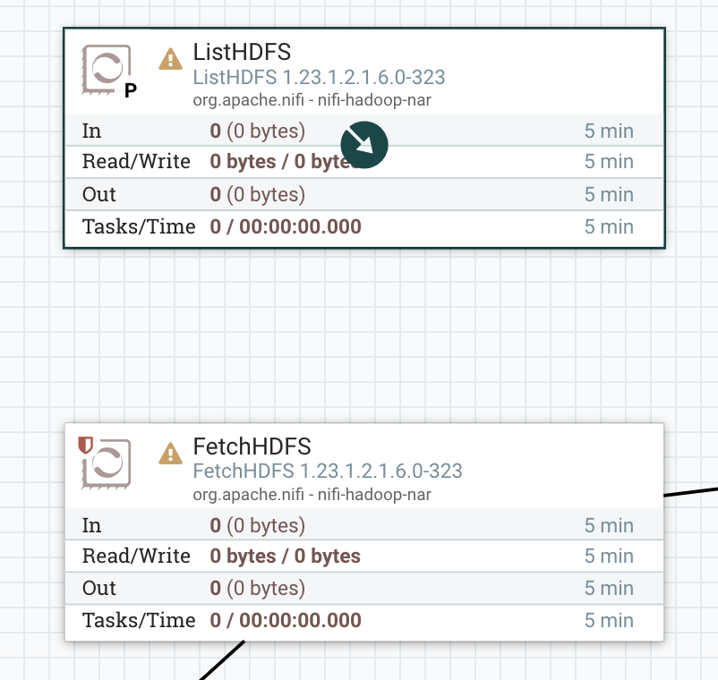

# CSO Hands-on Lab

The primary goal of this repo is to cover the following-->

**1.** Using Nifi as a ingestion and transformation tool to:
  - Ingest data from a local repository into HDFS
  - Pre-process the files while covering different pseudonymization and anonimyzation techniques* 
    
  _*There will be a strong focus on reversible techniques (pseudonymization), by opposition to anonimyzation. Pseudonymisation is the process of replacing identifying information with random codes, which can be linked back to the original person with extra information; whereas anonymisation is the irreversible process of rendering personal data non-personal, and not subject to the GDPR_

  - Create separate tables for raw data and processed data

**2.** Create policies for different users in Ranger to provide the correct permissions for each of the data resources that are available from the previous step by giving access to users, profiling and masking data

**3.** Using Ranger and different CDP tools such as HUE (sql workbench),HDFS, and Jupyter Notebook; demonstrate how end users (analysts, admins and auditors) have access ONLY to the data that they are allowed to see/use

All steps will be run by attendees on their own edge to ai instance, a single node secured cluster running CDP
Private Cloud base with Nifi deployed. Because it's a very small instance, the purpose is to test features,
not to test performance of workloads at scale.

## 1. Access the EDGE2AI instance
To acess the instance, each user will need to register using the given Web Server and registration code. 
```
  Web Server:  http://34.197.112.233 
  Registration code:*clever_mccarthy
```


Once this is completed, register the user and create a password


You will be redirected to the main menu
_*Note: Users must check with their internal security team if the range for the services has to be whitelisted_


There can be different users that have access to the CDP platform, however for the purposes of this lab we will be using one:

**Admin**

```
  User: admin
  Password: Supersecret1
```


## 2. Data Ingestion and Transformation with NiFi
To access the NiFi UI go to the EDGE2AI Home url: http://34.197.112.233/  and select NiFi

Login as admin:


You will be redirected to the NiFi Canvas -->


### 2.1 Ingesting Data using NiFi

Pipelines in NiFi are referred as flows. 
The first step of the Flow that is going to be created will be ingesting the data from a storage system in this case HDFS.

For the purpose of this lab, there is a pre-step where users will download a sample dataset from this Repository:

```
  https://github.com/nhernandezdlm/CSO_HoL/tree/main/assets
```
The dataset will be uploaded into the local HDFS of each of the clusters using Hue.

To access Hue go to the EDGE2AI Home url: http://34.197.112.233/  and select Hue

Login as Admin:


You will be redirected to Hue -->


Follow these steps:

1. Go to Files


2. Create a New directory


Name it:

```
  test_data
```


3. Navigate to the directory


4. Upload the file


5. The file is stored in HDFS


6. Go back to the NiFi Canvas. Before adding any processor, the parameters must be configured. These are created within the Parameter Contexts. These contexts allow users to bind a set of configurations to any connector pipe at runtime. For that, click on the Hamburger menu on the top right of the canvas and select "Parameter Contexts"


7. Click on the + sign on the top right


8. Add the Name `root` and click on Apply


9. Close the window and do right click on any place in the canvas, click on Configure


10. Select root from the dropdown and click on Apply


and click on Apply 


11. Go back to the Paramenter Context on the Hamburger menu, and click on the pencil on the right side of the root row


12. Click on the + sign on the top right and add the information for the following parameters: 


```
Name --> Hadoop Configuration Resources

Value --> /etc/hadoop/conf.cloudera.hdfs/core-site.xml,/etc/hadoop/conf.cloudera.hdfs/hdfs-site.xml,/etc/hadoop/conf.cloudera.hdfs/ssl-client.xml,/etc/hive/conf.cloudera.hive/hive-site.xml
```

```
Name --> Kerberos Password

Value --> <admin-password>
```
_* For the password select Sensitive Value YES_


```
Name --> Kerberos Principal

Value --> admin
```

Click Apply


12. From the top grey Ribbon of the NiFi UI, select the first icon (processor) and drag it into the canvas


13. Type in the textbox `ListHDFS`


14. Configure the Properties Tab


_*For the enviroment variables add a # + { and then press ctrl + space --> this will show the options that have been configured in the Parameter Contexts_


15. Repeat step `12`, filter in the textbox for `FetchHDFS` and configure both the Properties and Relationships tabs


16. Click on the dark blue icon with an arror inside of the processor and drag it to the other processor. Click on add




### 2.2 Anonymize data in NiFi

To anonymize data in NiFi, you can make use of various processors and techniques. Here are some common steps to follow:

- Identify and select the fields that need to be anonymized.
- Use processors like `UpdateAttribute`, `ReplaceText`, or `AttributesToJSON` to manipulate the data.
- Apply masking techniques such as randomization, substitution, or encryption to the selected fields.
- Use processors like `EncryptContent` or `EvaluateJsonPath` to perform the required masking operations.
- Test the anonymized data to ensure that it meets the desired level of privacy and security.

_*For th purpose of this lab we have selected two processors ReplaceText and PutHDFS_

1. Repeat step `12` from the previous section **(2.1)**, filter for the ReplaceText processor, follow the configuration


2. Repeat step `12` from the previous section **(2.1)**, filter for the PutHDFS processor, follow the configuration. mMke sure to add passwords as they are set as Sensitive Values in the screenshot


3.  Repeat step `16` from the previous section **(2.1)**, connect both processors


4. For the purpose of this lab we will be creating an External Table in Hue. This table is the asset that end users will be accesing. Before that the permissions in Ranger need to be granted in the correct policy for the user admin

1. To access Ranger go to the EDGE2AI Home url: http://34.197.112.233/  and select Ranger

2. Login as Admin:


3. Go to cm_hdfs


4. Select policy 1


5. Update the valuues of the allow condition 


6. Go to Hue and run the following query in the Hive editor-->


```
CREATE DATABASE HR;

CREATE EXTERNAL TABLE HR.employees_Redacted
(id int,
name string,
age int,
phone string,
email string,
dateofbirth string,
region string,
salary int)

row format delimited 
fields terminated by ',' 
lines terminated by '\n' 
LOCATION '/user/admin/hive'
TBLPROPERTIES ("skip.header.line.count"="1");


SELECT * FROM HR.employees_Redacted;
```


### 2.3 Pseudonymize data in NiFi
To pseudonymize data in NiFi, there will be several options, including built-in processors, you can pick based on the strategy. For Data encryption, the "Encrypt Content" processor will support a number of very powerful and recognised encryption algorithms out of the box. For the purpose of this lab, we picked a hashing method, for illustration purposes, as hashing is not fully reversible and can be easily cracked.

Using  and a ReplaceText processor, the string is replaced with a hash before being written out into Hive.

The same regular expression is indicated to identify the email addresses in the source data.  
`([a-z]*)\.([a-z]*)@([a-z]*)\.([a-z.]{2,5})`

Using an expression from Nifi supported Expression Language, the last name in the email addresses is replace with a hash (Md5).
`${'$1'}.${'$2':hash('MD5')}@${'$3'}.${'$4'}`


The output is also written into HDFS to be read using Hue, in a different folder:  
`


The path picked here is:  
`/user/admin/hive/hashed`

In Hue, over the same database called "HR", run the below:  

```

CREATE EXTERNAL TABLE HR.employees_hashed
(id int,
name string,
age int,
phone string,
email string,
dateofbirth string,
region string,
salary int)

row format delimited 
fields terminated by ',' 
lines terminated by '\n' 
LOCATION '/user/admin/hive/hashed'
TBLPROPERTIES ("skip.header.line.count"="1");


SELECT * FROM HR.employees_hashed;
```


### 2.4 How to share Flows in NiFi

In NiFi user can create template that contain the flows that are in the canvas. At the same time, users can also import templates. For the purpose of this lab, there is a template un the `assets` directory in this repository

To upload a Nifi template:  
1. In the Nifi Canvas UI, select the "Upload template" button in the left hand side configuration menu 

  

2. There will be warnings in each of the processors as the parameters will need to be configured

## 3. Data Masking in Ranger and Atlas

Withing the Cloudera tech stack, Atlas provides open metadata management and governance capabilities for organizations to build a catalog of their data assets, classify and govern these assets. Within Atlas, users can create their own classifications.

For example, resources (HDFS file/directory, Hive database/table/column etc.) containing sensitive data such as social security numbers,credit card numbers, or sensitive health care data can be tagged with any classification tag of the user's choice (usually "PII" or "confidential" or "sensitive") in Atlas, either as the resource enters the Hadoop ecosystem or at a later time. 

On the other side, Ranger enables users to create tag-based services and add access policies to those services.

*Tag-Based Policies Overview*
An important feature of Ranger tag-based authorization is the separation of resource-classification from access-authorization. 

Once a resource is tagged in Atlas, the authorization for the tag would be automatically enforced with Ranger,
thus eliminating the need to create or update policies for a particular esource.

Using tag-based policies also enables users to control access to resources across multiple CDP components without creating separate services and policies in each component.


Steps to follow --> 

### 3.1 Access Atlas and assign a "PII" categorization to Hive column "email" from the Hive table "employees"

To access Atlas go to the EDGE2AI Home url: http://34.197.112.233/  and select Atlas

1. Login as Admin:


2. In the Search By Text textbox type employees to find the table that has been created


3. Click on the table and explore the different tabs, as you can see Atlas inferred the metadata. Go to the schema tab


4. As part of the exercise the assumption is that the `email` column needs to be masked. For that, we will create a classification. For that click on the Classification option on the left blue panel and click on add. Add PII in the name and click Create


5. Once the classification is created go back to the table, click on the + icon in the right side of the `email` row and select PII


The entity `email` has been classified as PII


### 3.2 Access Ranger and create a Masking policy to redact any asset tagged PII


To access Ranger go to the EDGE2AI Home url: http://34.197.112.233/  and select Ranger

1. Login as Admin:


2. Within the Ranger UI, click on the Tag tab


3. Click on cm_tag and then go to the Masking Tab


4. Click on add New Policy


5. Name the policy, select the PII Tag, select the component permissions, masking options and create new policy


_*For this lab, Redact has been selected as the masking option_


### 3.3 Query the table from Hue and have a look at the result

1. Go back to Hue

2. Run the query by going to the editor icon and selecting Hive


```
SELECT * FROM HR.employees;
```

3. Review the results 


